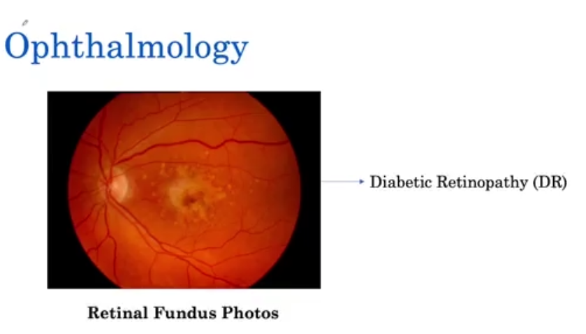
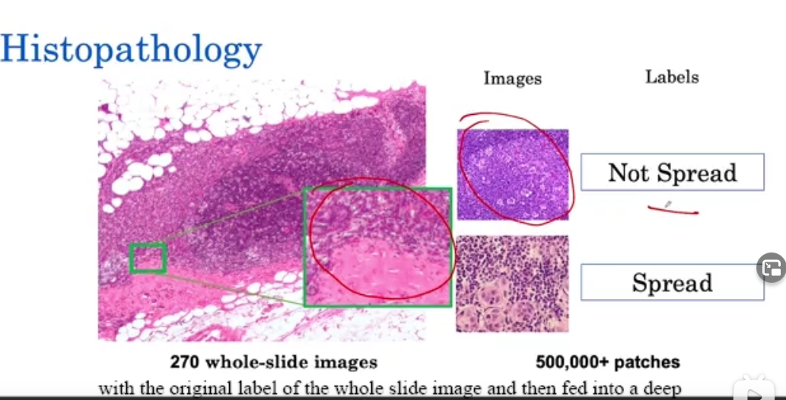
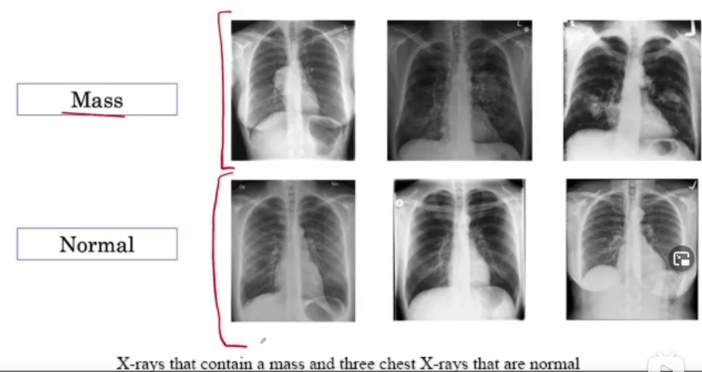

# AI for Medical Prognosis

medical diagnostic task 医疗诊断案例

edema  [ɪˈdiːmə] 水肿

fluid 积液

radiology 放射医疗

pneumonia [njuːˈməʊniə] 肺炎

dermatology [ˌdɜːməˈtɒlədʒi] 皮肤病学

dermatologist 皮肤病学家

determine whether a **mole** is a skin cancer or not 色素痣

ophthalmology [ˌɒfθælˈmɒlədʒi] 眼科学

retinal fundus photos 视网膜眼底图片

diabetic retinopathy 糖尿病型视网膜突变 

histopathology [ˌhɪstəʊpəˈθɒlədʒi] 组织病理学

pathologist 病理学家

lymph node 淋巴结

patch 色斑，小块

病理学图片都很大，因此每次都选出不同的patch进行训练

brain tumor segmentation 脑肿瘤分割

Chest X-Ray 可以检测many diseases，比如pneumonia, lung cancer, ，每年会新增2 billion图片。

分为Mass和Normal两种。pulmonary mass肺结节（肿块）

lesion [ˈliːʒn]  (因伤病导致皮肤或器官的)损伤，损害

diameter  [daɪˈæmɪtə(r)] 直径

Mass的定义：damage of tissue seen on a chest X-ray as greater than 3 centimeters in diameter

### 医疗领域的三大难题 3 Key Challenges

Class Imbalance; Multi-Task; Dataset Size

#### Class Imbalance

Binary Cross-entropy Loss
$$
\begin{aligned}

&{L(X, y})=\left\{\begin{array}{ll}
-\log P(Y=1 \mid X) & \text { if } y=1 \\
-\log P(Y=0 \mid X) & \text { if } y=0
\end{array}\right.
\end{aligned}
$$
对于损失函数来说，只要控制大部分y=0就可以让损失降到最小，因此改进损失函数。通常$w_{p}$取倒数

$$
L(X, y)=\left\{\begin{array}{ll}
w_{p} \times-\log P(Y=1 \mid X) & \text { if } y=1 \\
w_{n} \times-\log P(Y=0 \mid X) & \text { if } y=0
\end{array}\right.
$$