# AI for Medicine

[toc]


## AI for Medical Diagnosis

medical diagnostic task 医疗诊断案例

edema  [ɪˈdiːmə] 水肿

fluid 积液

radiology 放射医疗

pneumonia [njuːˈməʊniə] 肺炎

dermatology [ˌdɜːməˈtɒlədʒi] 皮肤病学

dermatologist 皮肤病学家

determine whether a **mole** is a skin cancer or not 色素痣

ophthalmology [ˌɒfθælˈmɒlədʒi] 眼科学

retinal fundus photos 视网膜眼底图片

diabetic retinopathy 糖尿病型视网膜突变 


histopathology [ˌhɪstəʊpəˈθɒlədʒi] 组织病理学

pathologist 病理学家

lymph node 淋巴结


patch 色斑，小块

病理学图片都很大，因此每次都选出不同的patch进行训练


brain tumor segmentation 脑肿瘤分割

Chest X-Ray 可以检测many diseases，比如pneumonia, lung cancer, ，每年会新增2 billion图片。

分为Mass和Normal两种。pulmonary mass肺结节（肿块）

skin lesion [ˈliːʒn]  皮肤病变

diameter  [daɪˈæmɪtə(r)] 直径

Mass的定义：damage of tissue seen on a chest X-ray as greater than 3 centimeters in diameter


### 医疗领域的三大难题 3 Key Challenges

Class Imbalance; Multi-Task; Dataset Size

#### Class Imbalance

##### Binary Cross-entropy Loss

$$
\begin{aligned}

&{L(X, y})=\left\{\begin{array}{ll}
-\log P(Y=1 \mid X) & \text { if } y=1 \\
-\log P(Y=0 \mid X) & \text { if } y=0
\end{array}\right.
\end{aligned}
$$
对于损失函数来说，只要控制大部分y=0就可以让损失降到最小，因此改进损失函数。通常$w_{p}$分母都是总数，分子取对方的数量来做平衡。用分数形式的好处是：Loss可以和之前没有加权重时可以比较。


$$
L(X, y)=\left\{\begin{array}{ll}
w_{p} \times-\log P(Y=1 \mid X) & \text { if } y=1 \\
w_{n} \times-\log P(Y=0 \mid X) & \text { if } y=0
\end{array}\right.
$$

##### Resampling

上采样和下采样

#### Multi-Task

可以有三个模型分别解决三个问题，但是用一个模型更加好，而且可以拥有共享的特征。

Mass vs No Mass

Pneumonia vs No Pneumonia

Edema vs No Edema

##### Multi-label / Multi-task Loss

$$
L\left(X, y_{\text {mass }}\right)+L\left(X, y_{\text {pneumonia }}\right)+L\left(X, y_{\text {edema }}\right)
$$


结合样本数量的平衡，我们可以给出对于分辨Mass任务的损失函数：
$$
\begin{array}{c}
\text { Multi-Task } \quad L\left(X, y_{\text {mass }}\right)+L\left(X, y_{\text {pneumonia }}\right)+L\left(X, y_{\text {edema }}\right) \\
L\left(X, y_{\text {mass }}\right)=\left\{\begin{array}{ll}
-w_{\mathrm{p}, \text { mass }} \log P(Y=1 \mid X) & \text { if } y=1 \\
-w_{\mathrm{n}, \text { mass }} \log P(Y=0 \mid X) & \text { if } y=0
\end{array}\right.
\end{array}
$$

#### Dataset Size

需要从大样本中学习，模型很大

##### ransfer Learning迁移学习

可以先从其他图像中预训练，前面的layer都是学习边缘特征。然后，固定前面的Layer，只对后面的Layer进行训练。

##### Data Augmentation数据增强

增强点：

不同的图片对比度/明暗程度不一样；

心脏一般在左边，但是不能进行图片的翻转，否则心脏就在右边dextrocadia了

对于Skin Cancer：Rotate+flip

对于组织病理学Histopathology：图片中有不同的阴影shade：可以通过Rotate+Crop+Color Noise制造不同的shade来帮助泛化。

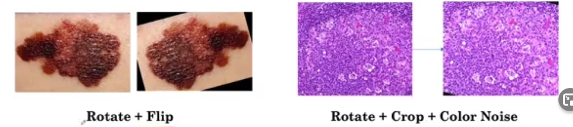

### 样本选取和训练集划分三大难题

#### Patient Overlap

- 要保持训练集和测试集独立。如果有一个带着项链的人的X-Ray一个在训练集一个在测试集，那么模型肯定会记住这个人的标签

反思：在第四范式的实际的项目中，当划分训练和验证样本时：是把份拆开按页划分的，而且同一种类别的样式也没有分开，因此不能保证训练集和验证集独立。

#### Set Sampling

- 小样本且样本不平衡时，要保证测试集中也要有正样本，一般可以设置一个至少 X%，或者在验证集中直接选取50%的正负样本
- 因此采样的顺序应当是：先Test Set再Validation Set最后才是Train Set

#### Ground Truth

inter-observer disagreement 各个专家意见不一：类似我们和业务认为的标注标准不一致。

- Consensus Voting

- 借助外力，比如说Mass的Chest X-ray还可以用CT打标签，比如皮肤病学Dermatology里，标签是由皮肤病变活组织检查skin lesion biopsy决定的

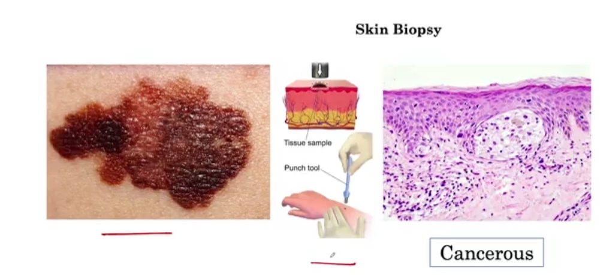

### 评价指标

### Sensitivity Specificity

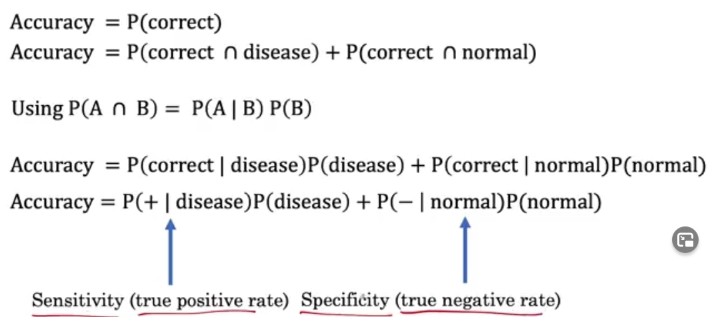

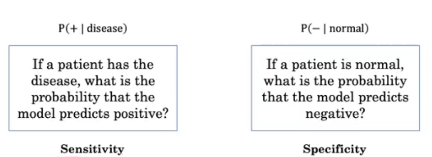

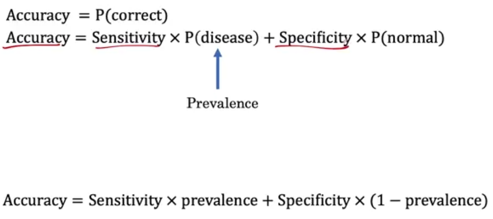

#### PPV NPV

以上的条件概率都是基于已知真实label，来推算预测结果为真的情况。此时如果知道预测结果，想看真是结果时：

PPV=Positive Predictive Value=P(disease|+)

NPV=Negative Predictive Value=P(normal|-)

其实PPV就是Precision，Sensitivity就是Recall

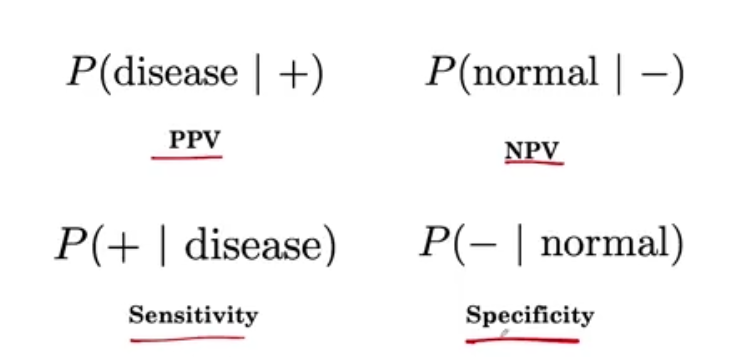

#### Confusion Matrix, ROC Curve, AUC

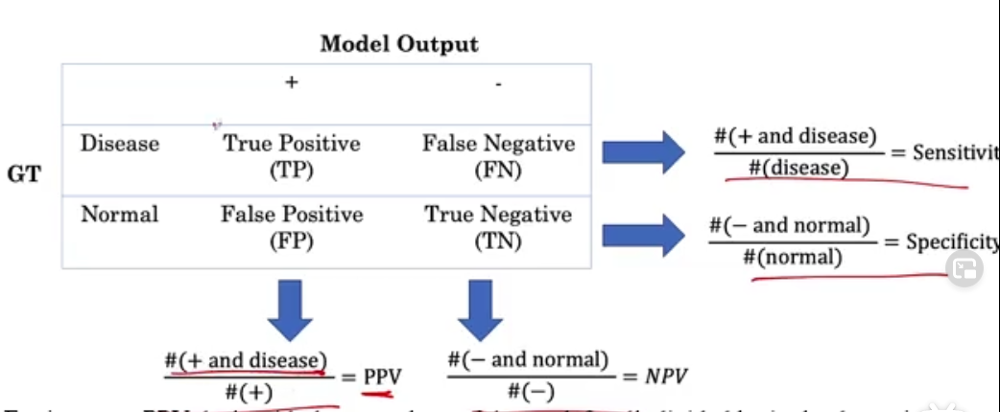

如果我把Threshold设为0，那么所有的样本都会被预测成+，Sensitivity会变成1，Specificity会变成0

如果我把Threshold设为1，那么所有的样本都会被预测成-，Sensitivity会变成0，Specificity会变成1

- 果然和马凯说的一样，在画ROC曲线前，先把所有的概率值从小到大排列，并带着他们的Label（红：+，蓝色：-）

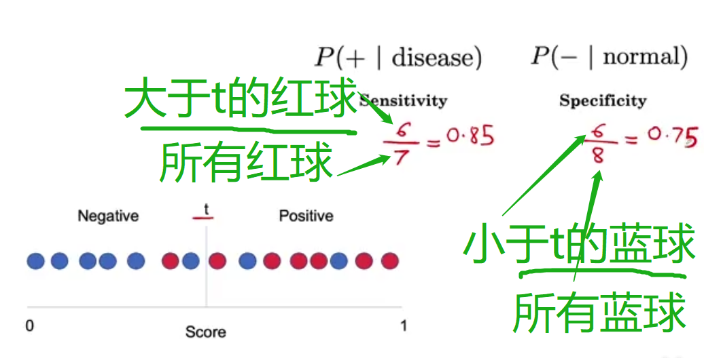

### 置信区间

误解：95%置信区间跟可能性没有关系！There is a nuanced difference细微的差别：

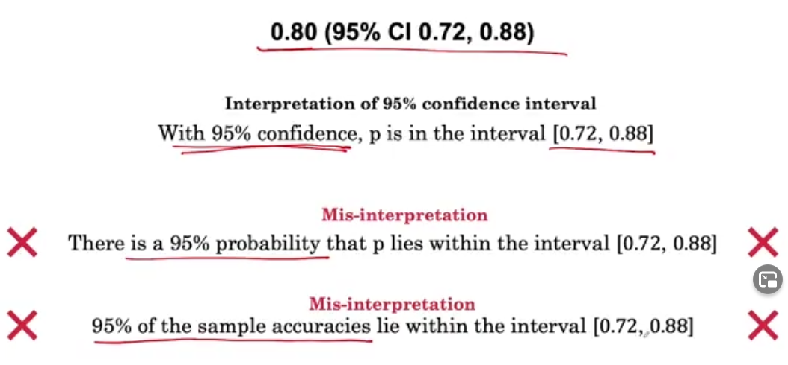

置信区间是你每一次抽样得到的区间，因此再做一次抽样会得到不同的置信区间

如下图：这是6次抽样带来的置信区间。因此，真正的解释是：95%的抽样里的置信区间会包含真实的总体值：p

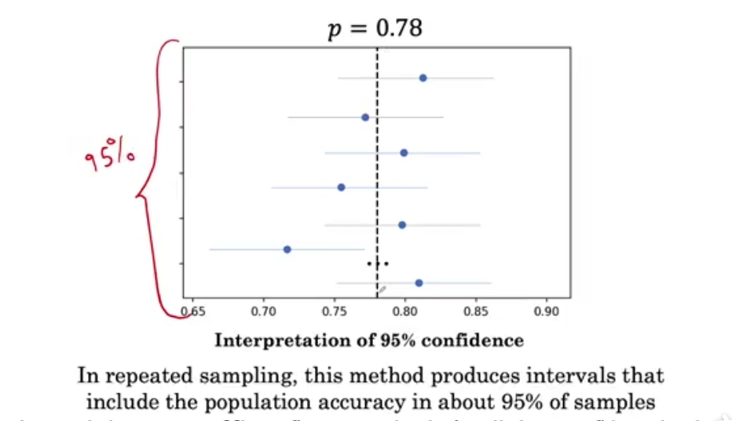

### MRI data

核磁共振

特点：多个连续的3D图像

处理方法：随机选取N（这里是3）个截面，就像是图片的3个channel一样进行输入，并把三个图片合成一张。

困难：这N张图不一定是正好对齐的Not Aligned，比如说有旋转，那么这些图片对应的位置会对不上

解决方法：[图像配准](https://www.cnblogs.com/carsonzhu/p/11188574.html)，通过[Image Registration](https://www.sicara.ai/blog/2019-07-16-image-registration-deep-learning)把图片摆正

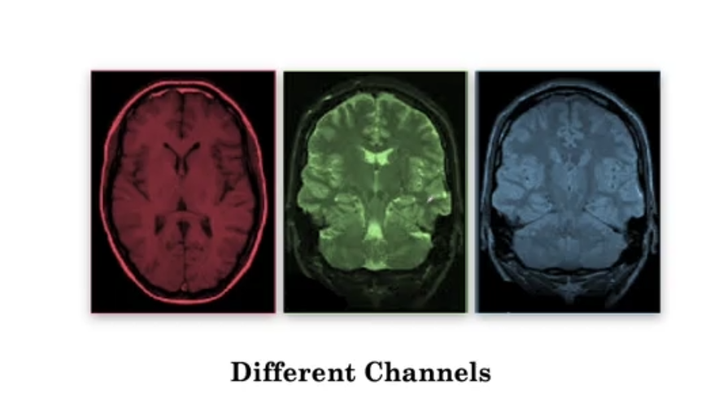

### Segmentation

2D的像素：pixel 

3D的像素：voxel

cortex information：大脑皮层信息

silver lining：困境中的一线希望

#### 2D方法

一张一张图片预测，然后再回到3D的分割块。但有可能失去3D信息 3D context。比如一个肿瘤在一张图片里，那么很可能旁边的图片里也有。但由于一张一张图片传，很可能学不到这个信息。

#### 3D方法

由于一次性放入3D太占内存，因此把3D图片切成小块，最后再拼起来。但也有可能丢失Spatial Context。

#### U-Net

包括Contracting（收缩） path和Expanding Path

只能用2D的方法训练

3D U-Net 所有操作都变成三维

#### Segmentation

把一张图像分成很多个小块进行预测，然后输出每个正方形小块的概率值。

##### Soft Dice Loss

减少Loss等于增加Overlap

p对应预测概率，g对应真实值

Loss越小，希望分子越大分母越小。因此可以突出g=1的情况，不会受到样本不平衡的影响。

如果p在g=0的地方都是1，虽然分子没有优化（都是0），但是分母会压缩，因此也会照顾到为0样本。

**引申**：[Dice Loss](https://zhuanlan.zhihu.com/p/86704421)即取绝对值的版本

[图像语义分割中的 loss function](https://zhuanlan.zhihu.com/p/101773544) cross entropy loss; weighted loss; focal loss; dice soft loss; soft iou loss

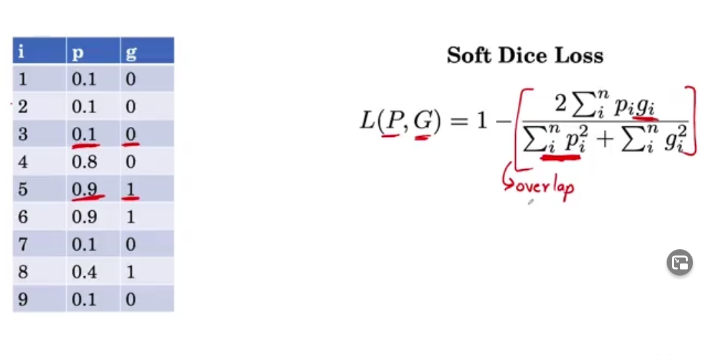

#### 局限性

TB test: tuberculosis 肺结核

retrospective data 历史数据

clinician 临床医师

- 标准不同：清晰度不一样

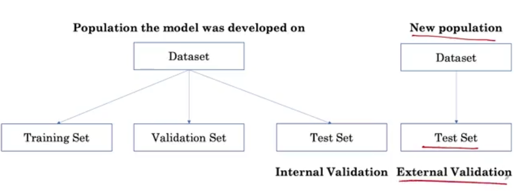


- 解决方法：可以用旧模型在新数据上，取一小部分用于调参

- 真实世界里还需要进行预处理，clean数据集。
- 训练数据都是Frontal X-ray，真实应用也有可能是侧面Lateral X-ray
- 真实世界要考虑Age, Sex, Socioeconomic Status
- clinician需要可解释性

## AI for Medical Prognosis

(对病情的)预断，预后; 预测; 预言; 展望;

Machine learning is a powerful tool for prognosis, and can provide a tremendous boost to this branch of medicine by using many different types of medical data to make accurate predictions about a patient's future health.

multiple examples of prognostic tasks, including a few examples where prognosis using risk calculations is part of **routine clinical practice**. 常规临床做法

mortality 死亡率

**Without further ado,** let's dive in. 毫不迟延; 干脆; 立即

there are blood tests that are used to estimate the risk of developing breast and **ovarian cancer**. 乳腺癌、卵巢癌

An example of this is **cancer staging**, which gives an estimate of the survival time for patients with that particular cancer. 癌症分期（晚期）

Another example is the six-month mortality risk. This is used for patients with terminal conditions that have become advanced and **uncurable** and is used to determine who should receive **end-of-life care**. 不能治愈的 临终关怀

estimating the 10-year **cardiovascular** risk of an individual. 心血管的;

Profile might also include physical exam findings such as **vital signs** including temperature and blood pressure. 生命体征

Atrial fibrillation 心房颤动（简称房颤）

Atrial fibrillation is a common abnormal **heart rhythm** that puts the patient at a risk of stroke. 心率 

A 70-year-old male diagnosed with Atrial fibrillation has **hypertension** and diabetes. 高血压

congestive heart failure CHF 充血性心脏衰竭; 心力衰竭; 

Liver Disease Mortality 肝病死亡率

This is the **model for end-stage liver disease** which produces what is called the MELD Score。肝病终期

**take the natural log** of the values before **plugging** them **into** the model. 

Now this makes sense because HDL-C is high-density **lipoprotein cholesterol** and that's often called good cholesterol. And thus we might expect would lower the risk of heart disease.脂蛋白 胆固醇

The apple in my left hand already looks **stale** and will expire in two days, 不新鲜的

#### *concordant* pairs

同序对（*concordant* pairs）和异序对（*discordant* pairs）

如果分类变量与数值预测结果方向相同，就叫concordant。如果数值预测两者一样，就叫risk tie

要形成permissible pair，就需要两个gt不同的人，也就是一定要一个死一个没死。

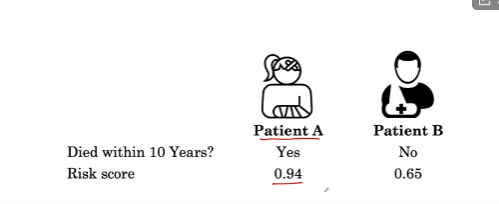

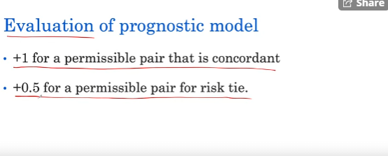

#### C-Index

注意：C-index和acc并没有直接的关系！

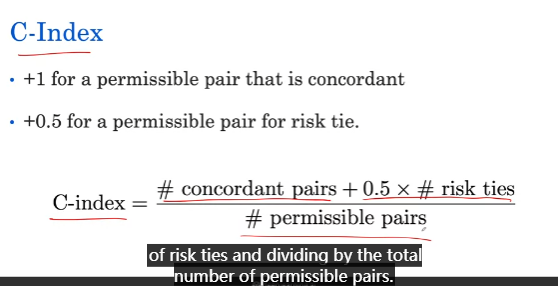

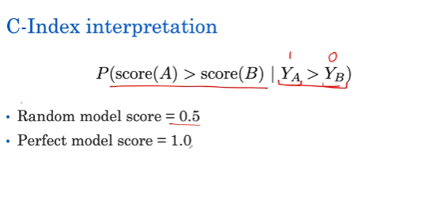

#### 用正态拟合数据

```python
from scipy.stats import norm
data = np.random.normal(50,12, 5000)
fitting_params = norm.fit(data)
norm_dist_fitted = norm(*fitting_params)
t = np.linspace(0,100, 100)
plt.hist(data, bins=60, density=True)
plt.plot(t, norm_dist_fitted.pdf(t))
plt.title('Example of Normally Distributed Data')
plt.show()
```

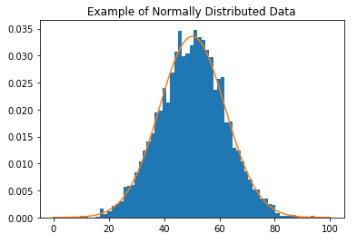

 *Diabetic Retinopathy* 糖尿病视网膜病变 

Often machine learning models are considered black boxes due to their complex inner workings, but in medicine, the ability to explain and interpret a model may be critical for human acceptance and trust. 

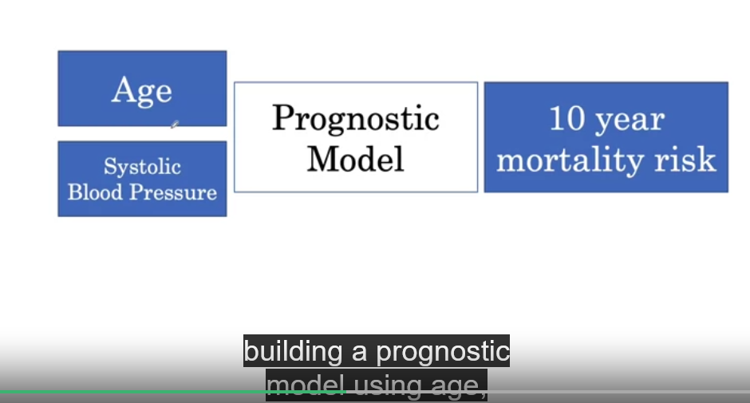

Systolic Blood Pressure 收缩压

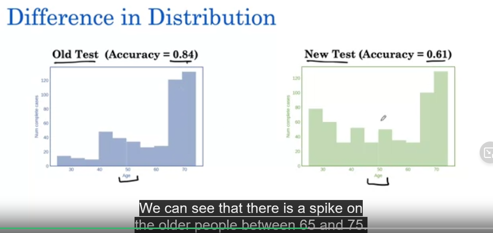

We can see that there is a **spike** on the older people between 65 and 75. 尖刺

缺失值的启示：删除缺失值有可能会让模型的训练数据的分布变化，从而导致效果不一致。由上图，old test里年轻人很少，很可能是医生不记录年轻人的血压，但他死了。由于空，我们删了这条数据，最终导致上线效果不一致。