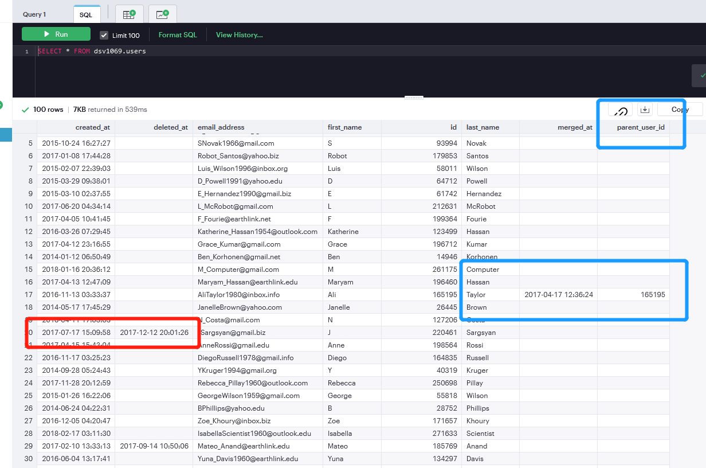
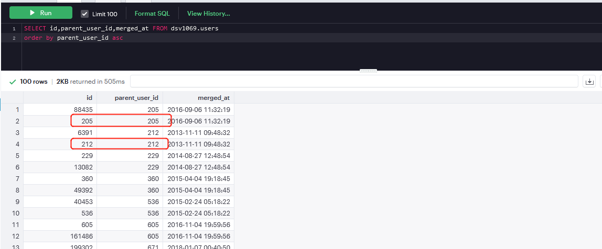
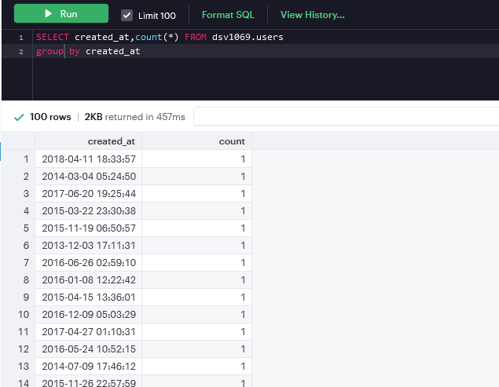
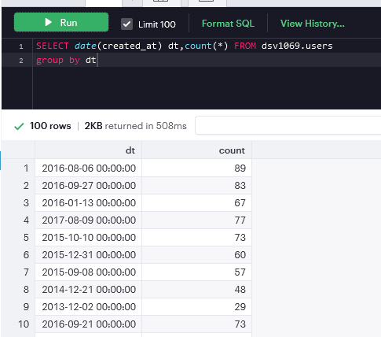

# SQL

## 结课练习

案例背景：

有的user是被删除deleted_at，有的user是被合并merge_at，并且合并时会有parent_user_id概诉你我当前的id被并到了哪个parent上。

首先，查看数据是什么样子的，发现即使合并也有的id和parent_user_id是一模一样的，这说明判断合并是，是两个同时并到一个上。其中：一个id得以保留，但也会留下相同时间的merged_at的记录；另一个的id消失，合并到对方身上。

接下来，查看一天中会有多少用户合并，并画出图像。简简单单的按时间戳排序是不现实的，我们希望要按天排序，因此加上函数date()。到此为止，并没有解决deleted_at和merged_at的问题，但我们也需要循序渐进慢慢来。

