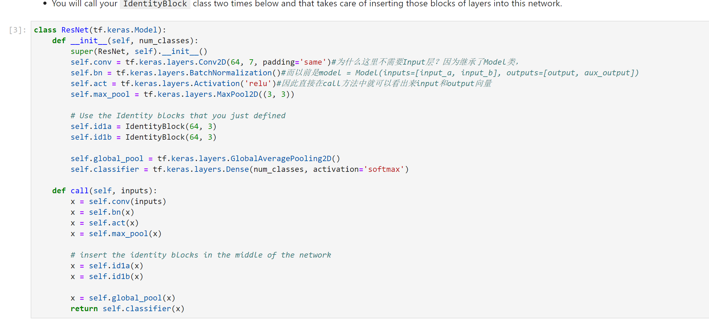
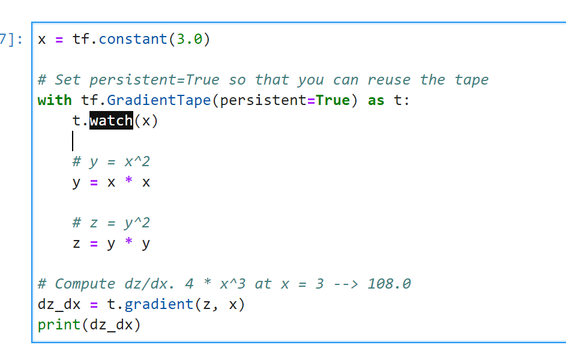
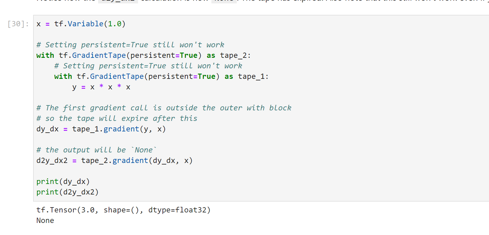
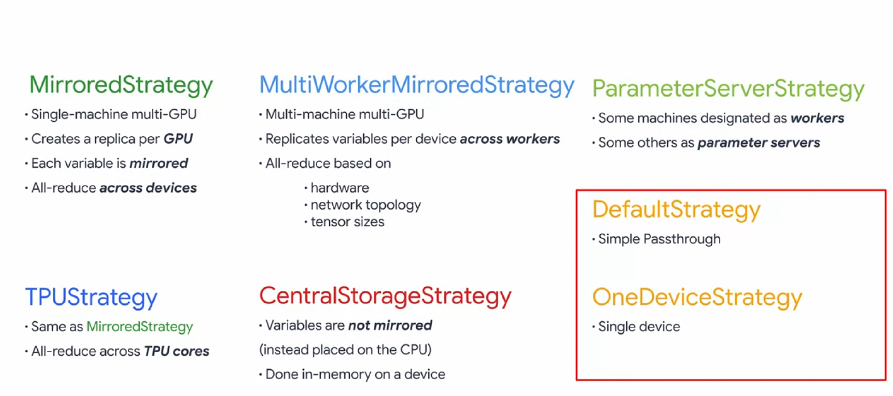

# Custom Models, Layers, and Loss Functions with TensorFlow

[Inception的变迁](https://towardsdatascience.com/a-simple-guide-to-the-versions-of-the-inception-network-7fc52b863202)

用watch记录对谁求导

第一个导数不能放在外面

epoch和step的区别：遍历完所有数据是一个epoch，每一次遍历时，只挑选batch_size=32是一个step，因此一个epoch里有很多step

[Multi-worker training with Keras](https://www.tensorflow.org/tutorials/distribute/multi_worker_with_keras)

